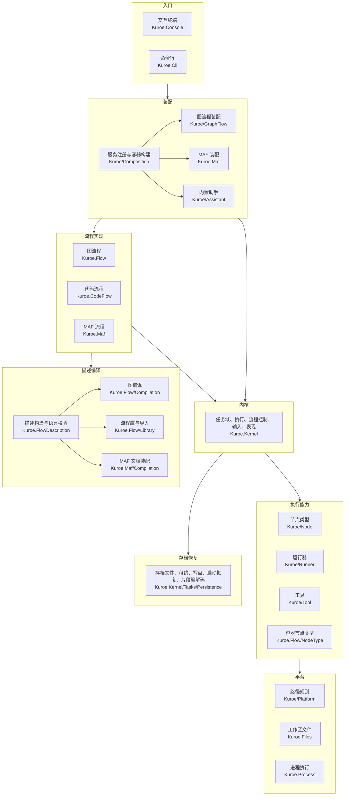

# 系统结构

```mermaid
flowchart TD
    subgraph LEntry["入口"]
        Console["交互终端<br>Kuroe.Console"]
        Cli["命令行<br>Kuroe.Cli"]
    end
    subgraph LHost["装配"]
        Composition["服务注册与容器构建<br>Kuroe/Composition"]
        GraphFlowHost["图流程装配<br>Kuroe/GraphFlow"]
        MafHost["MAF 装配<br>Kuroe.Maf"]
        Assistant["内置助手<br>Kuroe/Assistant"]
        Composition --> GraphFlowHost
        Composition --> MafHost
        Composition --> Assistant
    end
    subgraph LFlow["流程实现"]
        GraphFlow["图流程<br>Kuroe.Flow"]
        CodeFlow["代码流程<br>Kuroe.CodeFlow"]
        MafFlow["MAF 流程<br>Kuroe.Maf"]
    end
    subgraph LKernel["内核"]
        Kernel["任务域、执行、流程控制、输入、表现<br>Kuroe.Kernel"]
    end
    subgraph LAbility["执行能力"]
        Node["节点类型<br>Kuroe/Node"]
        Runner["运行器<br>Kuroe/Runner"]
        Tool["工具<br>Kuroe/Tool"]
        Container["容器节点类型<br>Kuroe.Flow/NodeType"]
    end
    subgraph LPlatform["平台"]
        Platform["路径规则<br>Kuroe/Platform"]
        Files["工作区文件<br>Kuroe.Files"]
        Process["进程执行<br>Kuroe.Process"]
    end
    subgraph LDescription["描述编译"]
        FlowDescription["描述构造与语言校验<br>Kuroe.FlowDescription"]
        FlowCompilation["图编译<br>Kuroe.Flow/Compilation"]
        FlowLibrary["流程库与导入<br>Kuroe.Flow/Library"]
        MafCompilation["MAF 文档装配<br>Kuroe.Maf/Compilation"]
        FlowDescription --> FlowCompilation
        FlowDescription --> FlowLibrary
        FlowDescription --> MafCompilation
    end
    subgraph LPersistence["存档恢复"]
        Persistence["存档文件、租约、写盘、启动恢复、片段编解码<br>Kuroe.Kernel/Tasks/Persistence"]
    end

    LEntry --> LHost
    LHost --> LFlow
    LHost --> LKernel
    LFlow --> LKernel
    LFlow --> LDescription
    LKernel --> LAbility
    LKernel --> LPersistence
    LAbility --> LPlatform
```
