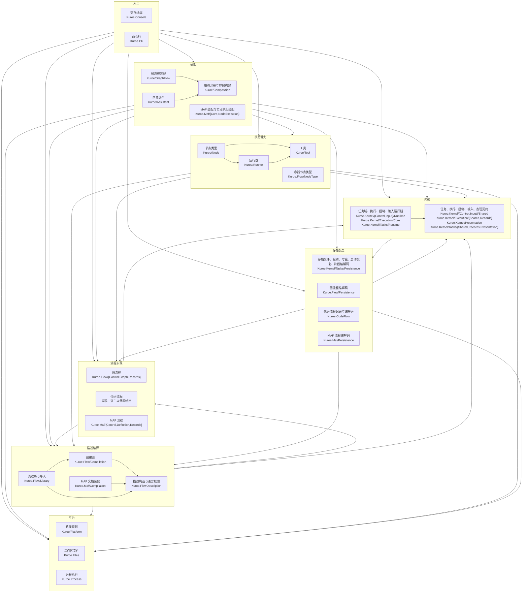

# 系统结构

节点标签列出该节点覆盖的全部源代码目录。`Kuroe/X` 指 `Source/Kuroe/X`，`Kuroe.X/Y` 指 `Source/Kuroe.X/Y`，花括号列出同一前缀下的多个子目录。每个目录只出现在一个节点中。箭头表示项目引用方向，从引用方指向被引用方。组间连线画在分组整体上，聚合组内项目的全部跨组引用；组内连线画在节点之间。

```mermaid
flowchart TD
    subgraph LEntry["入口"]
        Console["交互终端<br>Kuroe.Console"]
        Cli["命令行<br>Kuroe.Cli"]
    end
    subgraph LHost["装配"]
        Composition["服务注册与容器构建<br>Kuroe/Composition"]
        GraphFlowHost["图流程装配<br>Kuroe/GraphFlow"]
        MafHost["MAF 装配与节点执行装配<br>Kuroe.Maf/{Core,NodeExecution}"]
        Assistant["内置助手<br>Kuroe/Assistant"]
        GraphFlowHost --> Composition
        Assistant --> Composition
    end
    subgraph LFlow["流程实现"]
        GraphFlow["图流程<br>Kuroe.Flow/{Control,Graph,Records}"]
        CodeFlow["代码流程<br>实现由宿主以代码给出"]
        MafFlow["MAF 流程<br>Kuroe.Maf/{Control,Definition,Records}"]
    end
    subgraph LDescription["描述编译"]
        FlowDescription["描述构造与语言校验<br>Kuroe.FlowDescription"]
        FlowCompilation["图编译<br>Kuroe.Flow/Compilation"]
        FlowLibrary["流程库与导入<br>Kuroe.Flow/Library"]
        MafCompilation["MAF 文档装配<br>Kuroe.Maf/Compilation"]
        FlowCompilation --> FlowDescription
        MafCompilation --> FlowDescription
        FlowLibrary --> FlowCompilation
        FlowLibrary --> FlowDescription
    end
    subgraph LAbility["执行能力"]
        Node["节点类型<br>Kuroe/Node"]
        Runner["运行器<br>Kuroe/Runner"]
        Tool["工具<br>Kuroe/Tool"]
        Container["容器节点类型<br>Kuroe.Flow/NodeType"]
        Node --> Runner
        Node --> Tool
        Runner --> Tool
    end
    subgraph LPersistence["存档恢复"]
        Persistence["存档文件、租约、写盘、启动恢复、片段编解码<br>Kuroe.Kernel/Tasks/Persistence"]
        GraphCodec["图流程编解码<br>Kuroe.Flow/Persistence"]
        CodeRecords["代码流程记录与编解码<br>Kuroe.CodeFlow"]
        MafCodec["MAF 流程编解码<br>Kuroe.Maf/Persistence"]
    end
    subgraph LKernel["内核"]
        KernelRuntime["任务域、执行、控制、输入运行期<br>Kuroe.Kernel/{Control,Input}/Runtime<br>Kuroe.Kernel/Execution/Core<br>Kuroe.Kernel/Tasks/Runtime"]
        KernelContracts["任务、执行、控制、输入、表现契约<br>Kuroe.Kernel/{Control,Input}/Shared<br>Kuroe.Kernel/Execution/{Shared,Records}<br>Kuroe.Kernel/Presentation<br>Kuroe.Kernel/Tasks/{Shared,Records,Presentation}"]
        KernelRuntime --> KernelContracts
    end
    subgraph LPlatform["平台"]
        Platform["路径规则<br>Kuroe/Platform"]
        Files["工作区文件<br>Kuroe.Files"]
        Process["进程执行<br>Kuroe.Process"]
    end

    LEntry --> LHost
    LEntry --> LFlow
    LEntry --> LDescription
    LEntry --> LAbility
    LEntry --> LKernel
    LEntry --> LPersistence
    LEntry --> LPlatform
    LHost --> LFlow
    LHost --> LDescription
    LHost --> LAbility
    LHost --> LKernel
    LHost --> LPersistence
    LHost --> LPlatform
    LFlow --> LDescription
    LFlow --> LKernel
    LDescription --> LFlow
    LDescription --> LKernel
    LDescription --> LPlatform
    LAbility --> LFlow
    LAbility --> LDescription
    LAbility --> LKernel
    LAbility --> LPlatform
    LPersistence --> LFlow
    LPersistence --> LDescription
    LPersistence --> LKernel
    LPersistence --> LPlatform
    LKernel --> LPersistence
```