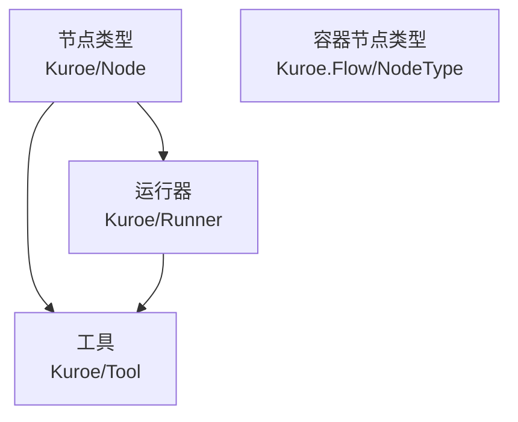

# 执行能力

上层结构见[系统结构](index.md)。

```mermaid
flowchart TD
    Node["节点类型<br>Kuroe/Node"]
    Runner["运行器<br>Kuroe/Runner"]
    Tool["工具<br>Kuroe/Tool"]
    Container["容器节点类型<br>Kuroe.Flow/NodeType"]
    Node --> Runner
    Node --> Tool
    Runner --> Tool
```