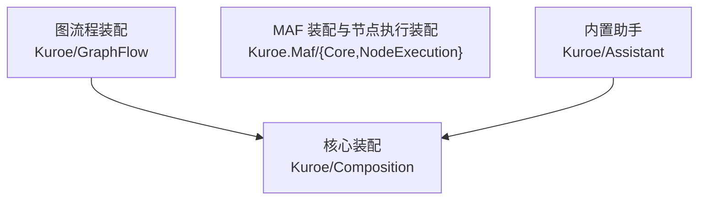

# 装配

上层结构见[系统结构](index.md)。

```mermaid
flowchart TD
    Composition["核心装配<br>Kuroe/Composition"]
    GraphFlowHost["图流程装配<br>Kuroe/GraphFlow"]
    MafHost["MAF 装配与节点执行装配<br>Kuroe.Maf/{Core,NodeExecution}"]
    Assistant["内置助手<br>Kuroe/Assistant"]
    GraphFlowHost --> Composition
    Assistant --> Composition
```