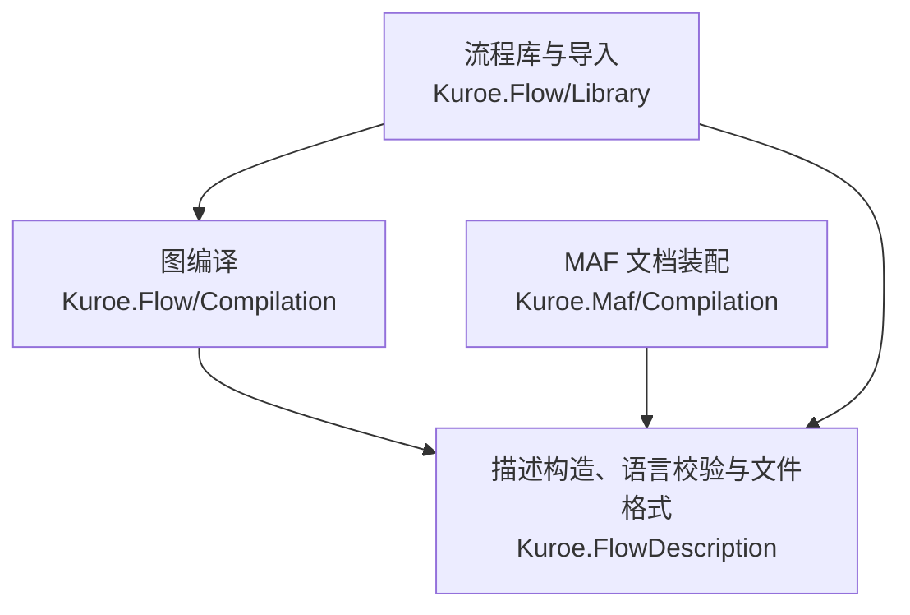

# 描述编译

上层结构见[系统结构](index.md)。

```mermaid
flowchart TD
    FlowDescription["描述构造、语言校验与文件格式<br>Kuroe.FlowDescription"]
    FlowCompilation["图编译<br>Kuroe.Flow/Compilation"]
    FlowLibrary["流程库与导入<br>Kuroe.Flow/Library"]
    MafCompilation["MAF 文档装配<br>Kuroe.Maf/Compilation"]
    FlowCompilation --> FlowDescription
    MafCompilation --> FlowDescription
    FlowLibrary --> FlowCompilation
    FlowLibrary --> FlowDescription
```