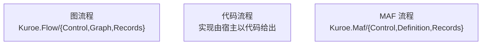

# 流程实现

上层结构见[系统结构](index.md)。

```mermaid
flowchart TD
    GraphFlow["图流程<br>Kuroe.Flow/{Control,Graph,Records}"]
    CodeFlow["代码流程<br>实现由宿主以代码给出"]
    MafFlow["MAF 流程<br>Kuroe.Maf/{Control,Definition,Records}"]
```