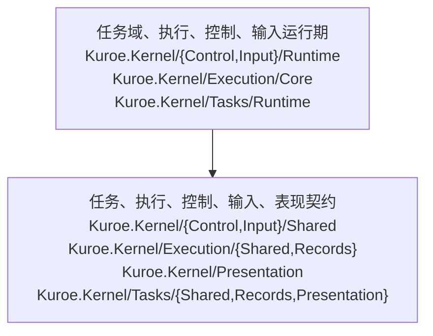

# 内核

上层结构见[系统结构](index.md)。

```mermaid
flowchart TD
    KernelRuntime["任务域、执行、控制、输入运行期<br>Kuroe.Kernel/{Control,Input}/Runtime<br>Kuroe.Kernel/Execution/Core<br>Kuroe.Kernel/Tasks/Runtime"]
    KernelContracts["任务、执行、控制、输入、表现契约<br>Kuroe.Kernel/{Control,Input}/Shared<br>Kuroe.Kernel/Execution/{Shared,Records}<br>Kuroe.Kernel/Presentation<br>Kuroe.Kernel/Tasks/{Shared,Records,Presentation}"]
    KernelRuntime --> KernelContracts
```